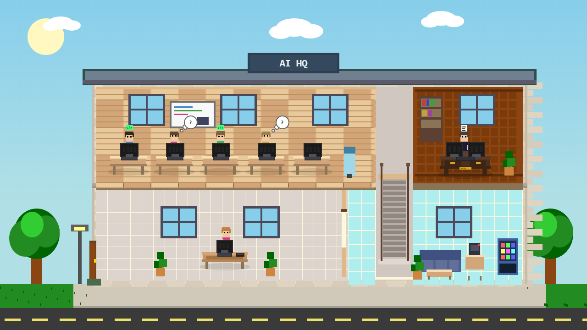

# AI HQ - Claude Code Visualizer

A pixel art office that animates in real-time based on your Claude Code sessions. Each Claude session gets its own character that walks into the office and works at a desk.



## Features

- **Side-scroller view** - Full building exterior with parking lot, trees, and interior office
- **One character per session** - Each Claude Code session spawns a unique character
- **5 workstations** - 4 in a pod arrangement, 1 separate desk
- **Living office** - Boss with activities, secretary that greets people, character conversations
- **Special characters** - Rare chance to spawn as alien, robot, werewolf, vampire, ninja, or zombie
- **Session panel** - Shows all connected sessions with numbered badges matching shirt colors
- **Configurable title** - Click the title to rename your office
- **Network accessible** - Access from any machine on your network

## Quick Start

### 1. Install dependencies

```bash
cd /path/to/ai-hq
npm install ws
```

### 2. Start the server

```bash
node server.js
```

Or use `start.bat` on Windows for auto-restart on changes.

Open http://localhost:3456 in your browser. The server will display the network URL for access from other machines.

### 3. Configure Claude Code hooks

Create the PowerShell script at a location like `C:/Users/<YOUR_USERNAME>/ai-hq/send-event.ps1` (the `send-event.ps1` file is included in this repo).

Add the hooks to your Claude Code settings (`~/.claude/settings.json`):

```json
{
  "hooks": {
    "PreToolUse": [
      {
        "matcher": ".*",
        "hooks": [
          {
            "type": "command",
            "command": "powershell -ExecutionPolicy Bypass -Command \"& 'C:/Users/<YOUR_USERNAME>/ai-hq/send-event.ps1' -Type tool_start -Tool $env:CLAUDE_TOOL_NAME\""
          }
        ]
      }
    ],
    "PostToolUse": [
      {
        "matcher": ".*",
        "hooks": [
          {
            "type": "command",
            "command": "powershell -ExecutionPolicy Bypass -Command \"& 'C:/Users/<YOUR_USERNAME>/ai-hq/send-event.ps1' -Type tool_end -Tool $env:CLAUDE_TOOL_NAME\""
          }
        ]
      }
    ]
  }
}
```

**Important:** Replace `<YOUR_USERNAME>` with your actual Windows username.

### 4. Restart Claude Code

Close and reopen Claude Code for the hooks to take effect.

## How It Works

Each Claude Code session will:
1. Create a new character that walks in from the parking lot
2. Go to an available desk
3. Animate based on what Claude is doing:
   - **Typing** - Edit, Write, Bash, NotebookEdit tools
   - **Thinking** - Read, Search, Glob, Grep, Task tools
   - **Idle/Wandering** - After 15 seconds of no tool activity
4. Characters persist at their desks between sessions (no leaving animation)

## Session Panel

The panel in the top-right shows all connected sessions:
- Numbered badge matching the character's shirt color
- Session title (working directory name)
- Current state with color indicator:
  - Green = typing/coding
  - Orange = thinking
  - Blue = walking
  - Gray = idle

## Endpoints

- `GET /` - Main visualization
- `GET /setup` - Plain text setup instructions (for other Claude sessions to read)
- `GET /status` - Debug info showing recent events and connected clients
- `POST /event` - Event endpoint for Claude Code hooks

## Event Format

POST to `http://localhost:3456/event`:

```json
{
  "type": "tool_start",
  "tool": "Edit",
  "sessionId": "unique-session-id",
  "title": "my-project"
}
```

Event types:
- `tool_start` - Claude started using a tool
- `tool_end` - Claude finished using a tool

## API

```javascript
// Add a session manually
pixelOffice.addSession('My Project')

// Remove a session
pixelOffice.removeSession(id)

// Set session state
pixelOffice.setSessionState('typing', id)
pixelOffice.setSessionState('thinking', id)
pixelOffice.setSessionState('idle', id)

// Set session title
pixelOffice.setSessionTitle('New Title', id)

// Get all sessions
pixelOffice.getSessions()
```

## Hidden Features

- Click the **sun** to restart the server
- Click the **title** to rename your office (saved to localStorage)

## Inspiration

This project was inspired by [PixelHQ](https://www.reddit.com/r/ClaudeCode/comments/1qrbsfa/i_built_a_pixel_office_that_animates_in_realtime/) by [u/Waynedevvv](https://www.reddit.com/user/Waynedevvv/) - a mobile app that does the same concept on your phone. Check out the original if you want a native iOS experience!
